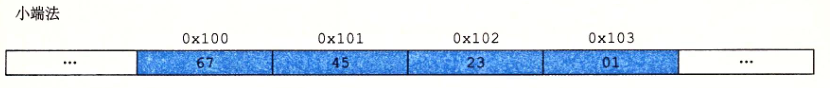

#程序的结构和执行 

##2.1信息的表示和处理
###2.1.1信息存储
####1.信息存储
字节：最小的可寻址的内存单位。不是访问内存中的单独的位。
机器级程序将内存视作大的字节数组，称为：虚拟内存。
内存的每个字节都有一个唯一的数字来表示：地址
所有可能地址的集合：虚拟地址空间
#####2.十六进制表示法
在C语言中，以0X开头的数字被认为是十六进制数字。  

二进制转十六进制：从右边低位开始，4位一组，最左边的组不足4位补0。  

十六进制转十进制：0x4CB2C -- 314156

十进制转十六进制：0x7AF -- 1967

#####3.字数据大小
字长：对一个字长为w的机器而言，虚拟地址的范围是0~2^w-1，程序最多访问2^w的字节

基本C数据类型的典型大小（注：int类型为4个字节，long类型在32位机器中是4字节，在64位机器中是8字节）

#####4.寻址和字节顺序
两个规则：对象的地址是什么？内存中如何排列这些字节？

在几乎所有的机器上，多字节对象被存储为连续的字节序列，对象的地址是所使用字节的最小的地址。
例如：一个int变量x的地址是0x100，那么，x的4个字节将被存储在内存的  **0x100，0x101，0x102,0x103**

**排列表示一个对象的字节的两个通用规则：**

假设：变量x的类型为int，位于地址0x100处，十六进制为0x01234567。

1.小端法：在内存中从按照最低有效字节到最高有效字节的顺序存储对象

2.大端法：与小端法相反

字节顺序的重要性的三种情况：

1.不同类型的机器之间通过网络传送二进制数据时。例如：小端法机器传送到大端法机器

2.阅读表示整数数据的字节序列时。

3.强制类型转换/union

  
###2.1.2整数表示
###2.1.3整数运算
###2.1.4浮点数
###2.1.5小结

##2.2程序的机器级表示

##2.3处理器体系结构
##2.4优化程序性能
##2.5优化程序性能

